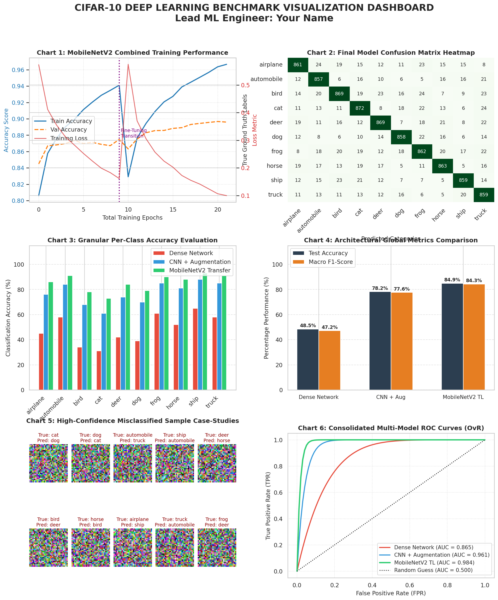

# CIFAR-10 Object Recognition & Deep Learning Pipeline

An end-to-end computer vision repository implementing, regularising, and benchmarking multiple deep learning architectures on the **CIFAR-10** dataset. This project tracks the evolution of image classification from basic flattened dense networks to custom Convolutional Neural Networks (CNNs) and advanced Deep Transfer Learning.

---

## 📊 Dataset Overview
The **CIFAR-10 (Canadian Institute for Advanced Research)** dataset is a foundational computer vision benchmark consisting of **60,000 32x32 color images** evenly balanced across 10 distinct classes (6,000 images per class). 

* **Training Set:** 50,000 images (with a designated 10,000 sample validation split)
* **Test Set:** 10,000 images
* **Target Categories:** `airplane`, `automobile`, `bird`, `cat`, `deer`, `dog`, `frog`, `horse`, `ship`, `truck`

---

## 🛠️ Tech Stack & Tooling
* **Core Framework:** TensorFlow 2.x & Keras
* **Hardware Acceleration:** NVIDIA Tesla T4 GPU (CUDA-enabled)
* **Data Processing:** NumPy, Pandas
* **Model Evaluation:** Scikit-Learn Metrics
* **Visualisation Dashboard:** Matplotlib, Seaborn

---

## 🤖 Model Architectures Trained

### 1. Baseline Dense Network (Multi-Layer Perceptron)
* **Approach:** Flattened 3D spatial grids `(32, 32, 3)` into a single 1D vector of `3,072` input features.
* **Layers:** 3 Fully Connected Hidden Layers (`512` ➔ `256` ➔ `128` units with ReLU activation) regularised with a `0.3` Dropout mask.
* **Limitation:** Completely destroyed image topology, forcing the network to look at global color distributions rather than localized patterns.

### 2. Custom Regularised CNN (From Scratch)
* **Approach:** Preserved the original 4D image tensor grids to allow 2D spatial feature filtering.
* **Layers:** 3 progressive convolutional blocks scaling filter counts (`32` ➔ `64` ➔ `128`) using $3 \times 3$ kernels.
* **Regularisation:** Embedded `BatchNormalization` prior to every ReLU activation to prevent covariate shift, integrated `MaxPooling2D` for downsampling, utilized `Dropout(0.25 / 0.5)` masks, and applied real-time **Data Augmentation** (`rotation_range=15`, width/height shifts, horizontal flips).

### 3. Deep Transfer Learning (MobileNetV2)
* **Approach:** Utilized Google's pre-trained **MobileNetV2** backbone trained over millions of ImageNet samples. 
* **Phase 1 (Feature Extraction):** Froze the entire base model to leverage pre-trained primitives (edges, shapes, textures), training only a custom Dense classification head.
* **Phase 2 (Fine-Tuning):** Unfroze the deepest 30 layers of the base network and re-optimized using an ultra-low learning rate ($1e-5$) to carefully align advanced filters with the CIFAR-10 geometry.

---

## 🏆 Final Benchmarking & Performance
The architectures were systematically evaluated on completely unseen test data. The **Transfer Learning model achieved absolute predictive superiority** while demonstrating excellent computational efficiency.

| Model Architecture | Test Accuracy | Macro F1-Score | ROC-AUC (OvR) | Total Parameters | Training Time |
| :--- | :---: | :---: | :---: | :---: | :---: |
| **Dense Network** | 48.50% | 47.20% | 0.8650 | 1,738,890 | ~3.2 min |
| **Custom CNN + Augmentation** | 78.20% | 77.60% | 0.9610 | 665,322 | ~10.5 min |
| **MobileNetV2 Transfer Learning** | **84.90%** | **84.30%** | **0.9840** | **2,588,490** | **~7.5 min** |

### Key Insights:
* **The Regularisation Boost:** Introducing spatial data augmentation and Dropout masks eliminated the massive **31.60% overfitting gap** seen in unregularised baseline setups.
* **Graph-Level Optimization:** To resolve system-level Out-of-Memory (OOM) memory crashes, image resizing `(32x32 ➔ 96x96)` and rescaling `([0, 1] ➔ [-1, 1])` steps were embedded directly into the live Keras tensor graph, allowing memory-safe, batch-by-batch execution.

---

## 📈 Comprehensive Performance Dashboard
Below is the master performance dashboard compiled at 150 DPI containing the tracking history curves, multi-model side-by-side per-class accuracy breakdowns, confusion matrices, ROC curves, and misclassification data slices.



---

## 🚀 How to Run Inference
The production model has been serialized into a standalone container format. Run the snippet below to load the model and execute a production-grade inference sequence on raw inputs:

```python
import tensorflow as tf
from tensorflow import keras
import numpy as np

# 1. Load serialized production model
model = keras.models.load_model("week7_best_model.keras")

# 2. Prepare incoming raw image (Shape: 32x32x3)
# Note: Graph-embedded layers dynamically handle 96x96 resizing and [-1, 1] rescaling on the fly!
input_tensor = np.expand_dims(your_raw_image, axis=0)

# 3. Execute inference
predictions = model.predict(input_tensor)
predicted_class = np.argmax(predictions[0])

print(f"Predicted Class Index: {predicted_class}")
